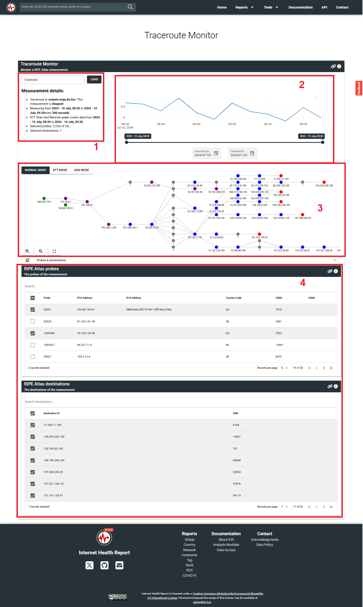

## My contributions

1. (Live) Batch measurement result fetching api call into chunks using filters - [PR Link](https://github.com/InternetHealthReport/ihr-website/pull/986)
2. (Live) RTT Chart and probes destinations table UI Improvements - [PR Link](https://github.com/InternetHealthReport/ihr-website/pull/1006)
3. (In Review) Additional updates in traceroute UI - [PR Link](https://github.com/InternetHealthReport/ihr-website/pull/1010)
4. (Live) (this PR was created before GSoC coding period, after eligible organizations announcement) Fix duplicate API calls - [PR Link](https://github.com/InternetHealthReport/ihr-website/pull/943)

## Project Link

[IHR Traceroute Monitor](https://www.ihr.live/en/traceroute-monitor)

## Project Description

The [IHR Traceroute Monitor](https://www.ihr.live/en/traceroute-monitor) enables an operator to analyze the traceroute measurement from [RIPE Atlas](https://atlas.ripe.net/docs/getting-started/what-is-ripe-atlas#what-is-ripe-atlas) (Backend).

RIPE Atlas is a global network of probes that measure Internet connectivity and reachability, providing an unprecedented understanding of the state of the Internet in real time.

A RIPE Atlas probe is a hardware that checks connectivity to a destination IP. For example, I live in India, want to monitor and analyze the connectivity to this domain -> content.ninja.ihr.live in Japan, I can connect a probe to my internet connection provided by my ISP.

A RIPE Atlas traceroute measurement result is a graph represented as an array of probe-to-destination network hops.

The [IHR Traceroute Monitor](https://www.ihr.live/en/traceroute-monitor) asks a measurement ID to fetch the corresponding traceroute measurement result data from this API endpoint -> https://atlas.ripe.net/api/v2/measurements/${measurementId}/results

The tool will:

- Process the complex traceroute measurement result object.
- Plot a network graph of probes-to-destinations covered in the RIPE Atlas measurement.
- Utilize the RTT data of measurement result object and plot a median RTT chart over time.
- Utilize the RIPE Atlas's probes and resources endpoints to fetch details about probes, intermidiate nodes and destinations like IP, ASN, Country code etc and display it in the probes and destinations tables.
- Provide filters to remove irrelevant time-range, irrelevant probes and irrelevant destinations.
  - A measurement result can be a large array of objects, including 1000s of probes which is running for years every 5 mins. Such a measurement is difficult to analyze. That is why we need filters for the analysis purpose.

### The UI for IHR Traceroute Monitor:

### Project structure

This project has mainly 4 widgets. I highlighted them in the image above.

1. Measurement Description

- Informs user about for how long the measurement has been running, what is the target, selected probes/destinations and selected time range.

2. RTT Line Chart

- For periodic measurements, we calculate median of all intermidiate hop's RTT for a given interval.
- On X-axis: there is the complete time range window sampled by intervals
- On Y-axis, there is median RTT for the given interval.
- This turns out to be useful to detect a sudden spike in median RTT, an operator can determine that there was a problem on certain traceroute.
- Observe the date pickers at the bottom of the chart. This is useful to filter the relevant time-range for analysis.

3. Network graph

- It is a visualization of traceroute measurement resut data in network graph format.
- There are 3 modes.
  1. Normal mode: Just plots the network graph.
  - Green nodes are for the probes
  - Red nodes are for the destinations
  - Blue nodes are for intermidiate nodes
  - Grey nodes are for non-responsive nodes.
  2. RTT mode: Each node changes its color according to its RTT.
  - Green color for the fastest RTT along the traceroute
  - Red color for the slowest RTT along the traceroute.
  - Colors between green and red: RTT between fastest and slowest RTT.
  3. ASN mode: Groups the nodes by ASNs. Each ASN group will have a separate color.
  - Random color will be assigned to a group of nodes belonging to ASN.

4. Probes and Destinations tables

- Probes table lists down all the probes. It will have Probe's id, ipv4, ipv6, ASN and country code.
- Destinations table lists down all the destination nodes. It will have destinations ipv4 and ASN.
- Observe the checkboxes on the left in each table. This is useful to filter relevant probes and destinations for analysis.

### How to use

Pre-requisite: User should know what a RIPE Atlas traceroute measurement is and the purpose of probes. A catalog of RIPE Atlas traceroute measurements is listed on [this link](https://atlas.ripe.net/measurements/public).

A user visits the catalog of RIPE Atlas traceroute measurements, then selects trace measurements for a specific destination IP addess. Based on the scope of the analysis, user selects a *small or *large measurement or \*one-off measurement.

Once the user has decided the measurement ID, he starts using [IHR Traceroute Monitor](https://www.ihr.live/en/traceroute-monitor).

1. Pastes the Measurement ID in the Measurement ID input box.
2. The measurement result data will be fetched.
3. The Measurement details widget shows the description. User verifies the details.
4. The RTT Chart widget plots the median RTT over time. User either shrink/expand/move the time range OR selects the start and end date-time for analysis.
5. The Network graph. User can analyze probes-to-destinations traceroutes.
6. User clicks on a node, the tool will highlight a path to detination and node details like country, ASN etc.
7. User selects/deselects some probes/destinations to plot a relevant network graph and RTT line chart.
8. User copies the URL after performing his analysis.
9. The filters gets automatically applied whenever user re-opens the tool using the copied URL.

### Initial loading strategy

To address the large measurements, the tool applies the following initial loading strategy:

- Fetch measurement result for latest 5 intervals only.
- Fetch measurement result for 5 probes only.
- Fetch probe details for 1000 probes only for the large measurements.

Important: If the URL query params for selected time-range, selected probes/destinations exist, then do not apply the above strategy.

### Terminology:

- Large Measurement: A measurement which has been running for months/years and utilizing ~1k probes with low interval time. Meaning the measurement result array is really large, in MBs of data.
- Small Measurement: A measurement which has ~100 probes and ran for just a few days weeks with a higher interval time. Meaning the measurement result array is small, in a few KBs of data.
- One-off Measurement: A measurement which has just ran for once. So, the interval is not defined.

## Project status

Before GSoC 2025:  
The structure for this tool existed.

- For smaller measurements it worked inefficiently.
- It could not handle the larger measurements, due to heavy volume of data.
- It was not able to apply any backend filters on traceroute measurement result API.
- It did not have much friendly UI.

After GSoC 2025:
The structure is updated.

- It handles all types (small, large, one-off) traceroute measurements from RIPE Atlas.
- It is able to apply backend filters and fetch relevant measurement result data.
- It has a friendly UI.

The above is an over-all status of the project. Now I will elaborate upon each problems in details.

### Types of traceroute measurements supported

1. All probes periodic large measurements (example measurement ID: 44852121)

- Before:
  - Not functional.
  - Did not apply the Initial loading strategy.
  - Tried to fetch the traceroute measurement result data of measurement that included ~15k probes and running for years every 5 mins.
  - The API request failed with the error: (failed)net::ERR_INSUFFICIENT_RESOURCES
- After:
  - Functional.
  - Applies the Initial loading strategy.
  - The above filters made the initial loading possible.
  - If there is a probe which is not among the 1000 initial probes, even then user can still load that probe's measurement result by adding that probe in the query param.

2. Periodic smaller measurements (example measurement ID: 75404443)

- Before:

  - Functional for smaller measurements.
  - Did not apply the Initial loading strategy.
  - Longer initial loading time. (~2 mins)

- After:
  - Applies the Initial loading strategy

3. One-off measurements:

- Before:
  - Unhandled. Broke the RTT chart, could not visualize the network graph.
- After:
  - The RTT chart for the one-off measurements are removed. Instead, will just display minimum RTT and maximum RTT among the hops.
  - Can visualize the network graph.

### UI improvements

1. RTT Chart:

- Before:
  - Functional. Lag due to high amount of data.
  - Time-range slider date labels were not updating as user shrink/expand/move the time range.
  - For larger measurements (interval = 5 mins, measurement running for years), it was impossible to pick a relevant time range from the slider.
  - Date pickers did not exist.
- After:
  - Added date pickers to select relevant start and end date-times for analysis.
  - According to this time-range, the measurement data is fetched from the backend.
  - The labels on the time-range slider updates as user slided the range.

2. Probes and destinations tables

- Before:
  - Functional.
  - User could select/deselect a probe/destination to include/exclude it from the analysis.
  - Did not have table sorting.
  - Did not have any logic for when to include a destination in the network graph
- After:
  - User can sort the probe/destinations table using any column.
  - User can choose whether to select/deselect the new destination after...
    - Updating the time range
    - Selecting probes
  - The above can be done using select all check box. 3 states are there for the select-all checkbox:
    1. Select All - new destinations will be selected by default
    2. Deselected All - new destinations will NOT be selected by default
    3. Some Selected - new destinations will NOT be selected by default

3. Network graph:

- Before:
  - Functional.
- After:
  - Removed the ASN legends from the ASN mode because it was covering the network graph.
  - Removed the min RTT and max RTT from the RTT mode because it was already present on the legend.
  - The RTT mode legends are corrected. Minimum RTT on the bottom - green color. Maximum RTT on the top - red color.
  - The zoom buttons and full screen button is moved to the bottom left so that it does not cover the RTT legends in RTT mode.
  - Traceroute measurement Description is moved from the network graph top-left, since it was covering the network graph.

4. Traceroute description:

- Before:
  - It was placed on the top-left of the network graph, covering a few network nodes.
- After:
  - Now it is placed just below the measurement input box to catch the user attention.
  - Added the details as sentences with highlighting on relevant details.

5. URL query params:

- Before:
  - Query params for measurement ID, probes list and destination list existed but non functional.
- After:
  - Functional.
  - User can directly add a measurement ID, multiple probeIDs, multiple destination IPs, selected start time and selected end time as filters through query params.
  - Initial loading strategy will be skipped, because user has already provided the filters.
  - The query params get updated as user selects a filter (probe, detsination, start time, end time) on the UI.

6. Loading icons (Done by mentor - Dimitrios):
   Functionality: Show a loading spinner on the widgets which are not ready yet. This feature did not exist before GSoC 2025.

7. UI layout update (Done by mentors):
   Mentor - Romain designed a new layout for the tool. Mentor Dimitrios arranged the existing components in the new layout.

8. Refinements (Done by mentors):
   Mentors - Malte, Romain and Dimitrios did additional testing and figured out a few enhancements. So, mentor - Dimitrios made a few commits related to the project.

## Pending items

### Enhanced RTT analysis

Currently, the tool provides median RTT line chart which covers all the selected probes-to-destinations hops.
For better analysis:

- We can provide grouping options so that the charts can be grouped by probes, destination ips, probe ASNs, destinations ASNs etc.
- We can provide aggregation operations to apply on a group, ie. median, average or minumum RTT.

## My learnings

1. Understading the emit and watchers behaviour in Vue.js.
2. Utilizing Quasar components.
3. Communicating clearly with the mentors.
4. Understading the purpose of this tool.
5. Managing time.
6. [Documenting](https://developers.google.com/tech-writing/overview)
